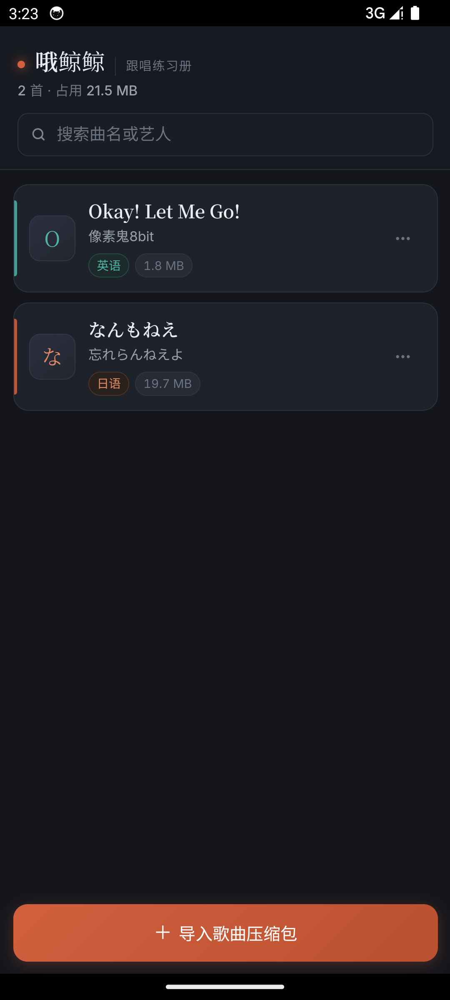
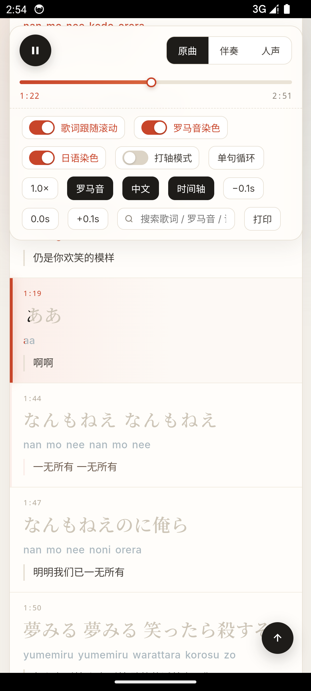

<div align="center">

**[English README →](README_EN.md)**


# 跟唱练习手册 · SingAlong

**一个跑在你自己电脑上的伴奏分离面板。**
上传 mp3，出来伴奏和人声 —— 全程本地 AI 推理，音频不离开你的机器。

做好的成品压缩包再推进手机 App，变成随时能翻开的跟唱练习册；电脑端直接点击跟唱页html文件就可以进行练习。

[](../../releases)
[](../../releases)
[](../../stargazers)
[](LICENSE)
[](安装环境.md)
[](安装环境.md)
[](player/README.md)
[](AGENTS.md)





</div>

---

## 🐣 完全不懂代码？从这里开始

**「面板」是什么？** 就是一个网页。你双击一个图标，浏览器自动打开一个页面，
往里面拖歌、点按钮，完事。它不联网上传任何东西，跑在你自己电脑上。

### Windows：下载 → 双击，搞定

安装方式二选一（都在 [Releases](../../releases) 页面下载）：

| 方式 | 下载什么 | 适合谁 |
|---|---|---|
| **在线装机版**（17MB） | `SingAlong-Setup-v1.6.exe` 一个文件 | 网络稳定；安装时自动下载约 3.6GB 环境+默认模型（25-50 分钟，断了自动续传重试） |
| **离线安装包**（约 3.3GB） | `SingAlong-Setup-v1.6.exe` + `SingAlong-Offline-part1.zip`、`part2.zip` 全部 | 网络差/想一次下载到处装；**下载完断网也能装** |

**离线包装法**：把所有文件放进同一个文件夹，把几个 part zip **全部解压到当前文件夹**
（会得到一个 `payload` 文件夹），然后双击 exe——检测到 `payload` 就全程本地安装，不联网。

装完后：双击桌面**「跟唱练习器」** → 浏览器自动打开面板 → 点「① 工作流」拖一首歌进去。
安装开头会弹窗让你**点选安装文件夹**（取消=默认 `%LOCALAPPDATA%\SingAlong`），
结束前会问**是否创建桌面快捷方式**。

<details>
<summary>⌨️ 习惯命令行？一条命令下载（PowerShell / cmd 均可）</summary>

```powershell
# 在线装机版（17MB）
curl.exe -L -o SingAlong-Setup-v1.6.exe https://github.com/Non-sth/sing-along-handbook/releases/latest/download/SingAlong-Setup-v1.6.exe

# 离线安装包（ exe + 2 个分卷，约 3.3GB）
curl.exe -L -o SingAlong-Setup-v1.6.exe https://github.com/Non-sth/sing-along-handbook/releases/latest/download/SingAlong-Setup-v1.6.exe
curl.exe -L -o SingAlong-Offline-part1.zip https://github.com/Non-sth/sing-along-handbook/releases/latest/download/SingAlong-Offline-part1.zip
curl.exe -L -o SingAlong-Offline-part2.zip https://github.com/Non-sth/sing-along-handbook/releases/latest/download/SingAlong-Offline-part2.zip

# 解压全部分卷到当前文件夹（Windows 11 自带 tar）
tar -xf SingAlong-Offline-part1.zip
tar -xf SingAlong-Offline-part2.zip

# 运行装机程序
.\SingAlong-Setup-v1.6.exe
```

</details>

> 手滑删了桌面图标 / 把 exe 挪了位置？没关系——去安装目录
> （默认 `%LOCALAPPDATA%\SingAlong`）找到启动器 exe，双击照样能开。

### macOS：能用，但没有一键安装包

mac 安装包（.app/.dmg）必须在 Mac 电脑上才能制作，作者暂时没有 Mac，
所以 macOS 用户走「5 条命令」路线（约 15 分钟，全可复制粘贴）：
👉 **[安装环境.md · macOS 章节](安装环境.md#macos)**，装完后每次用
`bash panel/启动分离面板.sh` 一条命令启动。

### 想看看软件长什么样？

双击打开 **[项目介绍.html](项目介绍.html)** —— 一份可以在浏览器里翻页的图文幻灯片。

---

## 这是什么

**主体是一个 Web 面板**，跑在你自己的电脑上，浏览器打开 `127.0.0.1:8848` 就能用。

它把原本要敲十几行命令行的本地 AI 人声分离，变成**拖个文件进去点一下**：

```
┌──────────────────────────────────────────────┐
│        伴奏分离面板  panel/                   │  ◄── 主页在这儿
│         http://127.0.0.1:8848                │
│                                              │
│  ① 工作流      全流程编成节点链，一键跑完      │
│  ② 音轨分离    上传 mp3 → 伴奏 / 人声          │
│  ③ 歌词+时间轴  没有歌词？从音频/视频识别      │
│  ④ 制作跟唱页  原唱+伴奏+歌词 → 跟唱页 HTML    │
│  ⑤ 音频降噪    专用降噪模型剥底噪/电流声       │
│  ⑥ 模型库      联网下载模型 · 按显卡分级推荐   │
│  ⑦ 语音台      打字 → 角色语音（可换声线模型） │
│                                              │
│  每页顶部 🚀 GPU 开关 · 环境自检 · 能力清单    │
└──────────────────────────────────────────────┘
          │
          │  做好的成品文件夹（跟唱页 + 音轨 + 字幕）
          ▼
┌──────────────────────────────────────────────┐
│      手机播放端  player/   （最后一环）        │
│      8 MB · 完全离线 · 零存储权限             │
└──────────────────────────────────────────────┘
```

**为什么值得自己搭一套**：现成的卡拉OK App 只能唱它曲库里的歌，
音质、歌词、时间轴都由平台决定。而这条路让你**把任何一首歌变成自己的练习材料** ——
逐字染色、单句循环、变速，而且**素材不出你的电脑**。

> 🛈 **完全不懂代码？** 直接双击打开 **[项目介绍.html](项目介绍.html)** ——
> 一份可以在浏览器里翻页的图文幻灯片，几分钟看懂整个流程。

---

## 🎛️ 主角：伴奏分离面板

### 它解决什么问题

命令行人声分离是这样的：

```bash
python -m audio_separator.separator.cli \
  --model_filename bs_roformer_revive.ckpt --output_dir ./out \
  --output_format mp3 --mp3_bitrate 320 --single_stem instrumental \
  --demucs_segment_size 256 ...（还有十几个参数）
```

参数要查文档、模型名要记、环境要激活、ffmpeg 要配 PATH。
**用完第一次，第二次就忘了上次怎么敲的。**

面板把这些**全部预先固化**：环境在哪、模型有哪些、ffmpeg 装没装、
显存够不够，打开页面就知道；上传文件点一下就跑。
顺带把**能做什么、做不到什么**直接摆在界面上，省掉"试了才发现不行"的反复。

### 能做什么

| | |
|---|---|
| 🔗 **工作流一键全流程** | 把「降噪 → 分离 → 歌词 →（可选 AI 翻译）→ 出片」编成节点链，每个节点可开关、可选模型；**启动前自动预检**，缺什么文件/模型逐项列出，不会白跑 |
| 🎯 **提取伴奏轨** | 去掉人声只留伴奏 —— 跟唱练习的主产物 |
| 🎤 **提取人声轨** | 剥出干声，扒唱法、对音、验证分离质量 |
| 🧹 **音频降噪** | 专用降噪模型（UVR DeNoise 系）剥底噪/电流声/环境轰鸣；可作分离前置工序 |
| 📝 **歌词识别** | 没有歌词文件？从音频/视频里识别：内嵌字幕 → 酷狗 KRC → 画面 OCR → ASR 的优先链 |
| 🔀 **12+ 模型** | RoFormer（质量最高）/ Demucs 四轨六轨 / MDX-Net 轻量 / 卡拉OK 专用 |
| 🌐 **模型库联网下载** | 24 个主流模型一键下载（国内镜像可达）；按你的显卡标注 🟢充裕/🟡偏紧/🔴超出，超出的直接推荐「缩水版」 |
| 🧩 **个人模型识别** | 自己下载的模型丢进文件夹即可：自动识别架构、估算显存、预判能否加载 |
| 📁 **统一文件浏览器** | 所有「选择文件」都打开同一个网页内文件夹浏览器，从盘符逐层进入、随时返回上级 |
| ⚖️ **多模型 A/B** | 同一段音频跑多个模型，产出可同步切换的试听页，切换时保留播放位置 |
| ✂️ **选段处理** | 只分离第 X 秒到第 Y 秒 —— **先跑 30 秒试效果**，别跑完整曲才发现不行 |
| 📚 **排队批处理** | 一次提交多个文件，串行执行（单卡 GPU 串行反而更快） |
| ⚙️ **参数可控** | 格式 MP3/WAV、码率 192–320、只要伴奏/只要人声、segment 尺寸、混合精度 |
| 🔍 **环境体检** | CUDA / 显存 / torch / onnxruntime / ffmpeg 实时状态，缺什么当场告诉你 |
| 🖥️ **桌面快捷方式** | `bash run.sh shortcut` 一键建图标（不依赖 COM）；`--inspect` 可查任意快捷方式真实指向 |
| 📋 **能力清单** | 按「已就绪 / 需下载」两态标注，**不夸大** |
| 🎬 **一键出跟唱页** | 提交原唱+伴奏+歌词 → 跟唱页 HTML + ASS 字幕 + 打印版。**切轨不重置进度**，位置原样保留 |
| 🧩 **任意自定义层** | 罗马音 / 译文 / 粤拼 / 生词注释都能自己传时间轴接进来，页面还能现场「+ 添加层」并命名 |
| 🔌 **用户自带时间轴** | 已经有罗马音或译文轴的，直接上传即用 —— **不跑本地引擎**，再算一遍反倒是降级 |
| 🪶 **制作开关** | 不想生成的层直接不生成：页面、ASS 都更轻，也能适配低配设备 |
| 🎙️ **语音台（文字→语音）** | 打字就能出声：edge-tts 在线基底音 + 本地 DDSP-SVC 声线转换；8 种语气预设、AI 情感理解（先理解再说话）、一句多抽卡挑最好的、可换自己下载的声线模型，也能选「Edge 裸声线」秒出不加载模型 |
| 🚀 **每页独立 GPU 开关** | 分离/歌词/降噪/语音台各自可切 GPU/CPU；工作流等页有全流程总开关；显卡型号实时探测，换台电脑显示它的卡 |
| 🤖 **大模型设置（可选）** | 语音台的情感理解、歌词 AI 翻译都走它：DeepSeek 出厂内置只填 key，其他厂商（OpenAI 兼容）可自定义；**key 只存你电脑的用户目录，不进仓库** |
| 🈂️ **AI 翻译歌词 + 罗马音校检** | 工作流里的节点：大模型翻译外语歌词，顺手校检本地罗马音引擎的误拆并标红；产出双语 LRC 直接喂给出片 |

### 能力边界

诚实比夸大有用。这些是**已知边界**，不是 bug：

| 限制 | 原因 |
|---|---|
| **无法零残留** | 镲片、军鼓与人声齿音同占 4–8 kHz，伴奏高频必有"水声"样伪影；男声中低频与吉他贝斯重叠在 100–400 Hz，伴奏低频可能发闷。这是频域分离的相位不确定性所致，换模型只能减轻 |
| **不适合直接发布翻唱作品** | 伪影一进混音就露馅。要发布只能买官方 off vocal 轨。**自己练习则完全够用** |
| **不能破解 DRM 容器** | 酷狗 `.kgm` / `.mgg` 用流密码，非简单循环 XOR。正确做法是在客户端先导出明文，再拖进面板 |
| **不能实时、不能分任意乐器** | 离线推理，2:51 曲目约 50 秒；除模型支持的轨道外，无法凭空拆出"小提琴""合成器"等任意声部 |
| **系统内存是真瓶颈** | 权重在显存，但音频缓冲需 1.5–2 GB 系统内存。跑之前先关浏览器/通讯软件/播放器 |

### 快速开始

```bash
# ① 装环境（首次，约 15–30 分钟）—— 详见 安装环境.md
# ② 启动
panel\启动分离面板.bat          # Windows：双击
bash panel/启动分离面板.sh      # macOS / Linux
```

浏览器自动打开 `http://127.0.0.1:8848/`，看到顶部一排**绿色**状态条就成了。

> **没有 NVIDIA 显卡也能用**，只是慢 —— 同样一首 2:51 的曲子，
> GPU 约 50 秒，CPU 要 15–40 分钟。选路线的方法见
> [安装环境.md 第零节](安装环境.md#零先想清楚一件事你要用-cpu-还是-gpu)。

### 本机实测性能

| | |
|---|---|
| 硬件 | RTX 4060 Laptop (8 GB) + Ryzen 7 8845H |
| 30 秒片段 | 加载 3.7 s + 分离 7.1 s |
| 2:51 整曲 | 约 50 秒 |
| 显存峰值 | 3225 MB |
| 模型加载 | 3–30 秒（Demucs 更久） |

**面板不写死任何路径** —— 环境探测按
`环境变量 → 仓库内 .venv → 常见位置` 逐级找，找不到也不崩，
而是在页面上给出「缺什么 + 怎么补 + 找过哪些位置」。

---

## 📱 最后一环：手机播放端

面板做出来的成品是**一个文件夹**，里面是跟唱页 HTML 和几条音轨。
手机 App 负责把它搬进口袋。

### 为什么不能直接把 HTML 丢进手机

在电脑上做跟唱页很容易，**但手机上不行**。无论你把 HTML 传进手机、丢进网盘、
还是用某笔记 App 打开，都会撞上同一堵墙：

- 页面里的相对路径全部失效（`file://` 是不透明源）
- **音频进度条拖不动**（`file://` 的 HTTP Range 支持不可靠）
- 字体、样式悄悄降级成系统默认

App 的做法是**在 App 里跑一个只监听 `127.0.0.1` 的本地 HTTP 服务**来伺服你的歌曲文件夹：

> **曲目文件夹的目录结构和页面里的相对路径原样可用 —— 跟唱页一行都不用改。**

### 特性

| | |
|---|---|
| 🎤 原曲 / 伴奏 / 人声切换 | 跟唱、清唱、听人声 |
| 🎨 罗马音 · 逐音节染色 | 假名对齐到音节 |
| 📜 歌词跟随滚动 | 行级滚动 + 单句高亮 |
| ⏩ 变速播放 · 🔁 单句循环 | 慢下来磨那卡住的一句 |
| ⏱️ 打轴模式 | 时间轴微调 ±0.1s |
| 📦 批量导入 | 一个 zip 放多首歌，支持多选 |
| 📶 完全离线 · 🔐 零存储权限 | 字体在包里；导入走系统文件选择器 |

去 [Releases](../../releases) 下载 `SingAlong-Player-Android-vX.X.apk`，
或直接取仓库里 [`player/assets/跟唱练习手册-播放端-vX.X.apk`](player/assets/)（同一个文件，仓库内保留中文名），传到手机，
文件管理器点开安装即可。Android 7.0+，不联网，不装别的。

> 首次安装提示红字是正常的 —— APK 用自签名证书，不是 Google Play 分发。

详见 **[player/README.md](player/README.md)** 与 **[用户手册](用户手册.md)**。

---

## 🔧 可选：完整制作链路

面板已经覆盖了日常使用。不过面板背后还有一套更完整的流水线，
适合**从零开始**处理一首歌（比如从 B 站链接开始、歌词要 OCR 抠）。

### 九个阶段

| 阶段 | 做什么 | 判定门 |
|---|---|---|
| **S0** 定界 | 一句话任务卡 | 说得清输入/输出/语言 |
| **S1** 取源 | 拿到本地音频轨 | `ffmpeg -i` 读得出时长 |
| **S1.5** 素材体检 | （可选）降噪 / 修削波 | 问题清单为空 |
| **S2** 歌词获取 | 拿到歌词文本 | 过「歌词性校验」 |
| **S3** 时间轴 | 行级或逐字轴 | 首行时间不是 `16:34` |
| **S4** 分离 | `_伴奏` / `_人声` | 两轨存在且**不是同一个文件** |
| **S5** 出片 | 跟唱页 + ASS + 报告 | **报告已读**，待办为 0 |
| **S6** 校验 | 断言 + 截图 | 断言全过 + 视觉不错位 |
| **S7** 打包 | 独立目录 | 不依赖仓库目录 |
| **S8** 归档 | 干净的作品目录 | 中间文件已清理 |

### 歌词从哪来：7 级优先链

**从"免费且精确"往"昂贵且易错"找，找到就停。**

| 优先级 | 来源 | 精度 | 成本 |
|---|---|---|---|
| 1 | 用户直接给的歌词文件 | 最高（常带逐字轴） | 0 |
| 2 | 视频容器里的内嵌字幕轨 | 高 | 极低 |
| 3 | **本地酷狗 `.krc`** | **逐字轴 + 官方罗马音 + 官方译文 三合一** | 极低 |
| 4 | B站 CC 字幕 API | 中高 | 低 |
| 5 | 视频简介 / 置顶评论 | 低（无时间轴） | 低 |
| 6 | **画面 OCR**（硬字幕） | 文本准、时间粗 | 中 |
| 7 | **ASR**（faster-whisper） | 时间准、文本有幻觉 | 中高 |

**第 3 级是性价比之王** —— 一条 KRC 让取词、对轴、翻译**三道工序全部免做**。
但它不在音频旁边，文件名带 32 位哈希，**得按歌名关键词模糊搜**。

### 两条最有价值的实战经验

**① OCR 定文本，ASR 定边界 —— 不要二选一**

硬字幕场景下，OCR 的文本几乎无错（画面上就摆着）但时间粗；ASR 时间准但文本会幻觉。
正确做法是**每行起点用 OCR 帧级时间，末行终点用 ASR 段终点**。
（试过"按字数均分"和"用 ASR 段终点"，都会整段前移。）

**② 混音上 ASR 全灭，不代表没人声**

整轨混音 + VAD 过滤会让 Whisper 只吐一句「感谢观看」幻觉。
**正确顺序是先分离出人声轨再重跑 ASR** —— 同一模型立刻给出 42 句完整歌词。
别在混音上反复换模型/语言/VAD 参数，那三条路都试过，全部失败。

### 命令行入口

`run.sh` 会自动找到正确的 Python 环境与 ffmpeg：

```bash
bash run.sh check     # 环境自检：三个环境 + 包 + ffmpeg + CUDA 引导
bash run.sh demo      # 出三音轨跟唱页（混音 / 伴奏 / 人声 可切换）
bash run.sh doctor    # 素材体检：采样率/位深/削波/静音段
bash run.sh fetch     # 取源（yt-dlp）
bash run.sh lyrics    # 从视频抠歌词（OCR + ASR）
```

出片后打开 `examples/out/Demo Song_跟唱页.html` 即可看到成品。

---

## 🚀 完整工作流

最省事的方式是面板的**「① 工作流」页签**：选好源音频，把「降噪 → 分离 → 歌词 →
（外语歌可插「AI 翻译歌词」）→ 出片」编成一条节点链一键跑完；启动前会自动预检，
缺歌词、缺模型会逐项告诉你，不会白跑。

想分步精细控制也行：

```bash
# 1. 电脑上：打开面板，「② 音轨分离」上传歌曲，分离出伴奏
#    （或走上面的完整链路，从视频/链接开始）

# 2. 「④ 制作跟唱页」：提交 原唱+伴奏+歌词 → 出跟唱页
#    （出片时勾选「打包手机端 zip」可跳过第 3 步）

# 3. 把整个文件夹压成 zip

# 4. 传到手机（微信文件传输助手 / 数据线 / 网盘都行）

# 5. 手机上：导入 → 练
```

**App 认的锚点是「文件名以 `_跟唱页.html` 结尾」的文件** —— 文件夹名不算数，会递归找，
中文文件名没问题，一个 zip 放多首歌也行。

---

## 📁 项目结构

> **关于源码**：下表里带 ★ 的程序部分（`panel/` `player/` `tools/` `run.sh`）在**私有源码仓** `sing-along-handbook-dev` 里，
> 公开仓只放**文档 + 安装包**。想参与开发见下面的 [🤝 参与](#-参与)。

```
sing-along-handbook/
├── panel/                            ★ 主角：伴奏分离面板
│   ├── README.md                     功能全览 + API + 环境变量
│   ├── scripts/
│   │   ├── serve_separator.py        服务端（标准库 http.server，零框架依赖）
│   │   ├── studio.py                 出片引擎（跟唱页 + ASS + 打印版）
│   │   ├── romaji_engine.py          日语 → 罗马音，逐音节切分
│   │   ├── english_engine.py         英语音节切分 + 中文译文
│   │   └── lyrics_io.py              歌词读写（krc/lrc/ass/srt/txt）
│   ├── assets/
│   │   ├── separator_panel.html      前端界面（单文件、零依赖、离线可用）
│   │   ├── capabilities.json         能力清单与模型元数据
│   │   ├── model_catalog.json        模型库下载目录（24 个主流模型，镜像源）
│   │   └── karaoke_page_template.html
│   ├── 启动分离面板.bat / .sh        一键启动（自动探测环境）
│   └── 一键做跟唱页.bat              拖两个文件上去即出片
│
├── player/                           ◄── 最后一环：手机播放端
│   ├── README.md
│   ├── app/                          源码（Java + 单文件 HTML 界面）
│   ├── build-tools/                  手工构建链（不用 Gradle）
│   ├── tools/                        图标生成脚本
│   └── assets/                       预编译 APK
│
├── tools/                            辅助脚本（可选，面板没覆盖的场景）
│   ├── scripts/                      fetch_source / lyrics_from_video / audio_doctor …
│   └── references/                   各环节的详细规则文档
│
├── examples/                         无版权演示素材（克隆后即可跑通）
├── run.sh                            ★ 命令行一键入口
├── 项目介绍.html                   ★ 不懂代码也能看：HTML 幻灯片讲清整个过程（双击即用）
├── 项目介绍_EN.html                英文版项目介绍（English intro slideshow）
├── 安装环境.md                     ★ 从零装环境（含排错对照表）
├── 用户手册.md                     手机端使用
├── 仓库文件说明书.html              每个文件干什么
├── 演示素材与版权.md
├── 发布到GitHub.md
├── docs/                           README 用的界面截图
├── AGENTS.md                         ★ 给 AI 智能体的自动化指南
└── CHANGELOG.md / CONTRIBUTING.md / LICENSE
```

---

## 🤖 这个项目为 AI 智能体做好了准备

仓库包含一份 **[AGENTS.md](AGENTS.md)** —— 写给 AI 编程智能体（Claude Code / CodeBuddy / Cursor 等）看的操作手册。

把它连同仓库丢给智能体，它能读懂项目结构、知道构建命令、知道 30+ 个不能踩的坑，
从而**自动完成**：

```
「帮我给这首歌做个跟唱页」
  → 判断输入形态 → 走歌词优先链 → 选时间轴策略 → 分离 → 出片 → 读报告回填 → 校验

「帮我换个 App 图标」
  → 判断素材类型（特写 vs 插画）→ 选对脚本 → 生成五密度图标 → 构建 → 模拟机验证
```

---

## 🤝 参与

**这个项目用「公开仓 + 私有源码仓」两个仓库运作**，既不把全部代码摊开，也保证想一起做的人有路可走：

| 仓库 | 可见性 | 放什么 |
|---|---|---|
| [`sing-along-handbook`](https://github.com/Non-sth/sing-along-handbook) | 公开 | 文档、安装包（Release）、Issue、讨论 —— **所有人**都能看和下载 |
| `sing-along-handbook-dev` | 私有 | 完整源码、构建链 —— 邀请制，成为协作者后才能看和提交 |

### 三条参与路径

**① 任何人都能做（不用源码权限）**

- 报 bug、提需求：开 [Issue](../../issues)，附上你的系统、报错截图、复现步骤
- 改文档 / 翻译 / 写教程：文档就在公开仓，直接提 PR
- 推荐好用的分离模型：开 Issue 附上模型下载页与文件名，维护者会加进模型库

**② 想长期一起开发**

在 [Issue](../../issues) 或 Discussion 里说明**你想做什么、大概怎么做**，维护者看到后会把你的
GitHub 账号加进私有源码仓（Settings → Collaborators，个人账号不额外收费），之后你就能正常提 PR。

**③ 只想要功能不想要代码**

直接开 Issue 描述场景就行，需求描述得越具体越容易被实现。

### 特别欢迎

新的分离模型接入、非日语/英语的语言支持（韩语罗马音、粤语拼音…）、
界面主题、更好的歌词来源。

**两个硬约束**（提 PR 前请确认不违反）：
面板保持**零 Web 框架依赖**（只用标准库）；手机端保持**完全离线**。

---

## 📄 许可与版权

代码 [MIT](LICENSE)，随便用（含商用）。APK 里的字体（Noto Serif JP、Inter）为 SIL Open Font License。

**⚠️ 关于内容版权**：取词、分离、翻译三条链路**全部受版权约束**。

- 仓库里**不包含任何受版权保护的歌词或音频**
- `examples/` 与 `testdata/` 里都是程序合成的音轨 + 自写歌词，可自由使用
- 自己做、自己练属于个人使用；**公开分享成品页 / 音频 / 歌词属于复制与传播**
- 生成页面的页脚自带免责声明，请不要删掉

详见 [演示素材与版权.md](演示素材与版权.md)。

**🔐 关于签名密钥**：仓库里**不含签名密钥**（`.gitignore` 已排除 `keystore/`）。
公开密钥等于让任何人能签出**同签名** APK 冒充发布，所以每个构建者用自己的。
`build.sh` 检测到没有密钥会**自动生成一个** —— 记得备份。

---

<div align="center">

**如果这个项目帮你把练习搬到了自己手里，点个 ⭐ 就是最好的支持。**

</div>
